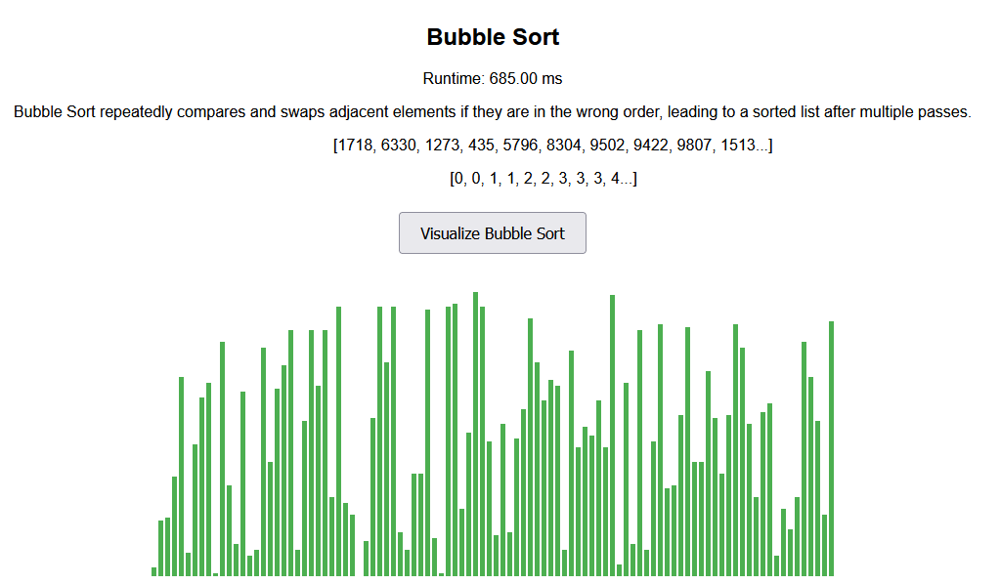

<!-- Include submenu from _includes to top of pages -->


<!--  -->

    <h1>Welcome to Srijan's Blog</h1>

 

## Hi I'm Srijan!

### If you're new here, feel free to check out my [LinkedIn](https://www.linkedin.com/in/srijan-atti-213918273/) 

### Learn a bit [about me](/srijan_2025/about/)

### Or browse a few of the many projects I've created:
### [Algorithms Compare](/srijan_2025/algorithm)
